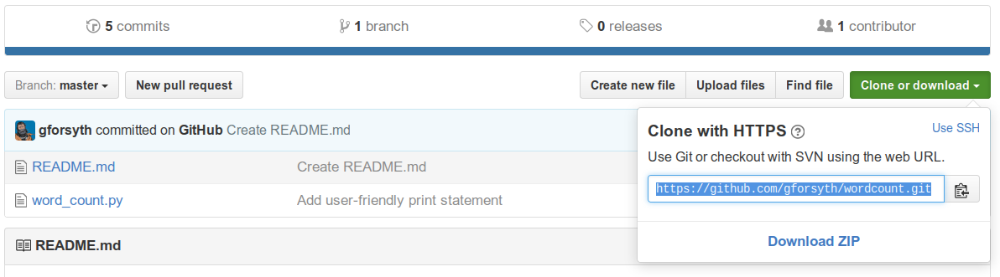
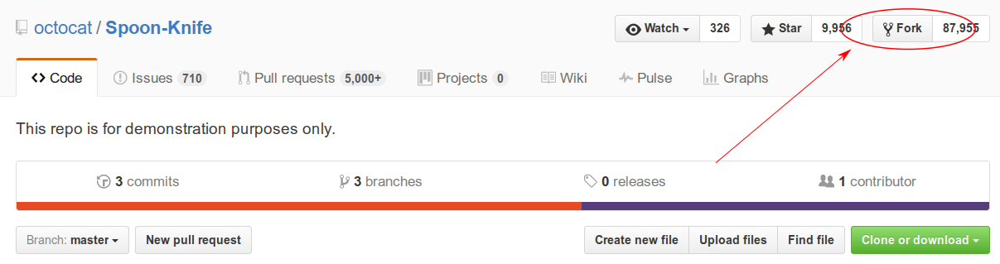
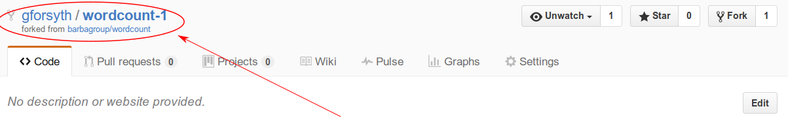
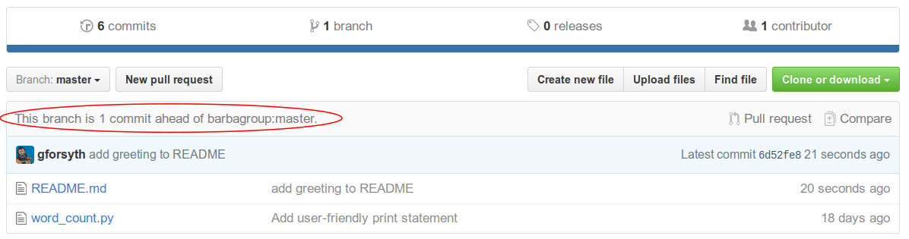
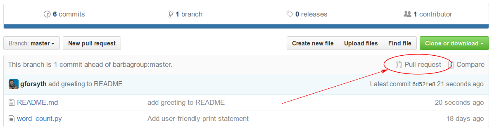
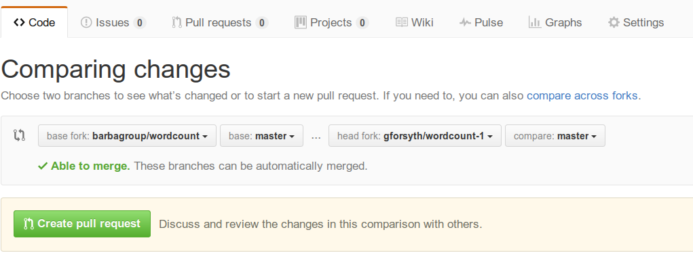

# GitHub Workflow

We've used GitHub so far as a tool to backup and restore our work across
different machines but always as a single user.

## how commits work

What exactly is a commit? We've talked about them up to this point as snapshots
of a file or files at a particular moment. That's an accurate description, but
it's also worth examining how commits are related to one another. This will help
develop intuition about why `git` handles certain situations the way that it
does.

When we learned about navigating the UNIX filesystem, we explained the file
structure as an inverted tree, where each folder can see all of the files and
folders below it, but can't see anything above it.


Commits have the exact opposite structure; the tree _isn't_ inverted, it's
right-side-up. If we think of the initial commit as the roots of the tree, each
commit can trace back to the initial commit via all of its ancestors, but has no
knowledge of any commits that come after it (its descendents).

## `git clone`

`git init` creates a _new_ repository. But often you don't to create a new
repository, but to copy an existing repository. Maybe you want to work on a
project at work and also after hours at home?

When you want to create a copy of an existing repository, you use the `git
clone` command.

## Clone an existing repository

First, visit my copy of the "wordcount" repository on GitHub located
at
[https://github.com/gforsyth/wordcount](https://github.com/gforsyth/wordcount)

On the right-hand-side, click the "Clone or Download" button:


Then copy the clone URL (make sure to use HTTPS!):



Now let's clone the repo. In a terminal, do `git clone <URL>`:

```text
$ git clone https://github.com/gforsyth/wordcount.git
```

```text
fatal: destination path 'wordcount' already exists and is not an empty directory
```

ACK. "fatal" is usually a bad sign. What happened? `clone`, by default, creates
a folder with the same name as the repository, so `wordcount`. But you already
have a folder called `wordcount` (right?), so `git` won't overwrite that copy
(and that's good).

In this case, we can specify a folder name for `git` to create that doesn't
conflict with the existing folder:

```text
$ git clone https://github.com/gforsyth/wordcount.git gil_wordcount
```

```text
Cloning into 'gil_wordcount'...
remote: Counting objects: 15, done.
remote: Total 15 (delta 0), reused 0 (delta 0), pack-reused 15
Unpacking objects: 100% (15/15), done.
```

You cloned your first repository! Now `cd` in and look at the repo history.

```text
$ cd gil_wordcount
```

```text
$ git log
```

```text
commit 3f62d8fe59fc6cbded99485a3bebec95e8703a7d
Author: Gil Forsyth <gforsyth@users.noreply.github.com>
Date:   Thu Dec 15 12:06:58 2016 -0500

    Create README.md

commit de8fbc35961f0b7412a8e862e212a50ea0dff7cc
Author: Gil Forsyth <gforsyth@users.noreply.github.com>
Date:   Wed Dec 14 18:02:38 2016 -0500

    Add user-friendly print statement

commit 09633c88bb3f8b40d1c988b1df9004245320462a
Author: Gil Forsyth <gilforsyth@gmail.com>
Date:   Tue Dec 13 11:01:11 2016 -0500

    add helper text to input function

commit 97fba8ddd7685e650813675f5b024267af0b94e7
Author: Gil Forsyth <gilforsyth@gmail.com>
Date:   Tue Dec 13 10:58:59 2016 -0500

    allow user input of statement to word count

commit 47f748fea14e14ed84452a802dc14a5ea0829949
Author: Gil Forsyth <gilforsyth@gmail.com>
Date:   Tue Dec 13 10:53:23 2016 -0500

    Add initial version of word count script
```

Those are the commits made in the instructor's repository. We have copied the
entire history of that repo to our own machine.

## Edit the cloned repo

That README.md file is pretty sparse so let's add something to it.

Open `README.md` in `nano` and add a greeting, something like "Welcome to the
wordcount repo!"

Now save the file, stage it and commit it! ([Need a refresher?](./git.md))

Now push those changes up!

```text
$ git push
```

```text
Permission denied.
fatal: Could not read from remote repository.

Please make sure you have the correct access rights
and the repository exists.
```

What happened? We don't have write access to that repository because it doesn't
belong to us. It would be a problem if anyone could overwrite a file on GitHub
whenever they felt like it.

But how do we propose a change to a repository if we don't have write access?

We fork it!

## forks

A fork is a complete copy of an existing git repository under your account.
Since it's yours, you now have the ability to make changes to it. Even cooler is
that once you've made those changes, you can then propose that they be added
back in to the original repository that you forked! This is the main mechanism
by which people contribute to other projects on GitHub.

To create a fork, first go to the GitHub page of the repository that you want to
fork. If you are in a guided workshop right now, please partner up with someone
near you and fork each other's repository. If you are following along on your
own, you can use a repository that GitHub has created specifically for this
purpose:

[Spoon-Knife Repo](https://github.com/octocat/Spoon-Knife)

To create a fork, click the "Fork" button in the top right of the repo:



When you click "Fork", GitHub will take a few moments to create a complete copy
of the repository under your control, then it will forward you to that page.

Notice that the username on the new page is _your_ username, but the repo name
is the same. Additionally, there will be a link under the repo name indicating
that it is a fork of an existing repository.



Also note that there is a little info bar right above the file listing:


The fork is _even_ with the upstream (original) repo. That means the history is
identical. Now let's make a change!

## `clone` your fork

Now that you have created a copy of the repo that _you_ control, go ahead and
clone it to your local machine. 

As we did earlier, make a small change to the `README.md` file in `nano`, then
save, stage and commit. Then try again to push your changes back to GitHub.

```text
$ git push
```

```text
Counting objects: 3, done.
Delta compression using up to 4 threads.
Compressing objects: 100% (3/3), done.
Writing objects: 100% (3/3), 349 bytes | 0 bytes/s, done.
Total 3 (delta 1), reused 0 (delta 0)
remote: Resolving deltas: 100% (1/1), completed with 1 local objects.
To github.com:gforsyth/wordcount-1.git
   d0dd1f6..31da785  master -> master
```

It worked! 

Now that we pushed a change to our _fork_, the fork itself is one commit _ahead_
of the upstream (or original) repository. The history of the two repositories is
identical except for the commit that we just created. 

Notice that the infobar above the file listing informs us that we are now one commit ahead of the upstream:




## Pull Requests

In order to add this commit to the original, we open a _pull request_ to propose
adding our change to the original repository. 

**Note:** `git` is a version control system. GitHub is an online service that
provides hosting for `git` repositories. GitHub also has additional features to
help with software collaboration, the most prominent of which is the "Pull
Request".

"Pull Requests" are _not_ a feature of `git`, but of GitHub. 

To create a Pull Request, click the link indicated in the figure below.



This will open up the following screen:



The "base fork" is the upstream location of the repository. It is the original
version of the repository that we forked. The "head fork" is our version of the
repo, that contains the changes we are proposing to add to the original.

Click "Create Pull Request".

On the following page, write a description of what you are proposing to add to
the original project with the changes you have made. In this case, we have made
a small, somewhat trivial change. In general, though, it is a good idea to write
a detailed description when you open a PR. 

You should include a description of the pull request's contents. Are you fixing
a bug that you found? Which bug? Are you adding a new feature to an existing
project? The more descriptive you are, the easier it is for the maintainers of
the original project to determine if they want to accept your contribution.

For the small README change, write a message something like:

"I added a greeting to the README to try to make it a little bit friendlier."

Then click "Create Pull Request" once more to finish.

## I opened a pull request, now what?

## creating a local fork (e.g. a branch)

## merging branches locally
