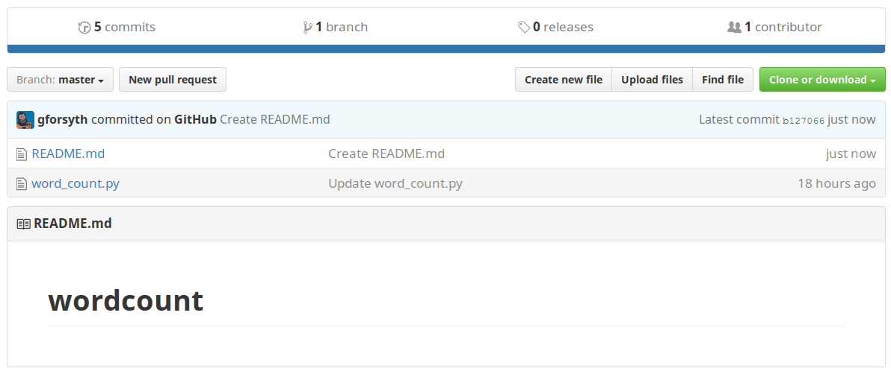
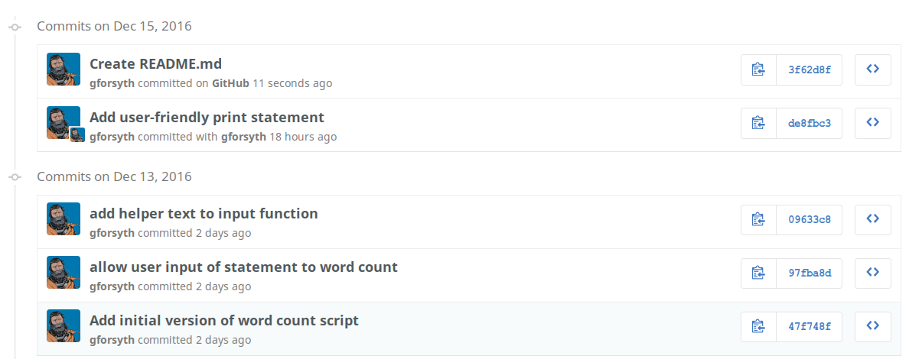
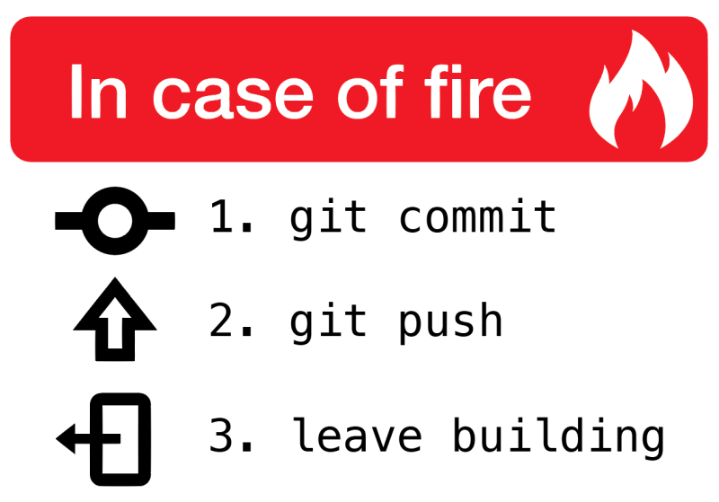

# Merging

We can make a commit in the local repo and push it to GitHub. We can also make a
commit on GitHub and pull it to the local repo. But what happens if we make a
commit in both places?

This happens all the time when multiple people are working on the same project.
Let's investigate how `git` handles these situations.

## Add a README to your GitHub repo

A README is a plain text file in the root of a repository that usually contains

- a brief description of a project
- installation instructions
- info on how to collaborate

or whatever else you want. 

Open your GitHub copy of the `wordcount` repo and then click the "Add README"
button


Don't worry about adding any additional text beyond what is automatically added
for you. And the default GitHub commit message for this change is reasonable, so
you can just click "Commit"



You should see something like the above, where the GitHub copy of the repo now has two files: `word_count.py` and `README.md`

## Make a change to the local repo

**Without** performing a `git pull` now edit `word_count.py` locally to read:

```diff
happy = input("Enter a statement to word count: ")

words = happy.split()  # split user input on spaces

counts = {}
for word in words:
    counts[word] = counts.get(word, 0) + 1

print("The word frequency of your statement is: ")
print(counts)
```

Stage and commit that change (remember the commands?). If we check the log in
the local copy of the repo, we should have something like:

```diff
$ git log --oneline
671907a add comment for future self
de8fbc3 Add user-friendly print statement
09633c8 add helper text to input function
97fba8d allow user input of statement to word count
47f748f Add initial version of word count script
```

But on GitHub, where we created the README file, the list of commits looks like



What can we do? 

Nothing to do but try something out. How about a `push`?

```diff
 git push
To github.com:gforsyth/wordcount.git
 ! [rejected]        master -> master (fetch first)
error: failed to push some refs to 'git@github.com:gforsyth/wordcount.git'
hint: Updates were rejected because the remote contains work that you do
hint: not have locally. This is usually caused by another repository pushing
hint: to the same ref. You may want to first integrate the remote changes
hint: (e.g., 'git pull ...') before pushing again.
hint: See the 'Note about fast-forwards' in 'git push --help' for details.
```

Ah, that didn't work. But the error message tells us what the problem is. There
is work on the remote that we don't have locally (the README file). It wants us
to integrate those changes into the local copy before we can push. Let's try
that.

```diff
git pull
remote: Counting objects: 3, done.
remote: Compressing objects: 100% (2/2), done.
remote: Total 3 (delta 0), reused 0 (delta 0), pack-reused 0
Unpacking objects: 100% (3/3), done.
From github.com:gforsyth/wordcount
   de8fbc3..3f62d8f  master     -> origin/master
Merge made by the 'recursive' strategy.
 README.md | 1 +
 1 file changed, 1 insertion(+)
 create mode 100644 README.md
```

That did something. `git` tells us that there was a "Merge made by the
'recursive' strategy". And it says that it created a file. Let's check.

```bash
$ ls
README.md  word_count.py
```

There's the `README`! Let's take a look at the `log`.
 
```diff
git log --oneline
aa92e92 Merge branch 'master' of github.com:gforsyth/wordcount
671907a add comment for future self
3f62d8f Create README.md
de8fbc3 Add user-friendly print statement
09633c8 add helper text to input function
97fba8d allow user input of statement to word count
47f748f Add initial version of word count script
```

Interesting. There's a `Create README.md` commit that we made on GitHub. That
one is further down in the list because it's older. Then there's the commit we
made locally, `add comment for future self`.

But what's that most recent commit? It's called a "Merge commit". We'll come
back to that a little bit later, but the quick explanation is that it's a commit
that helps join the _slightly_ divergent histories of the GitHub repo and the
local repo. 

One last thing before we move on, now that we have `pull`ed and `merge`d these changes, we should `push` those changes back up to GitHub. 

`push` often!




