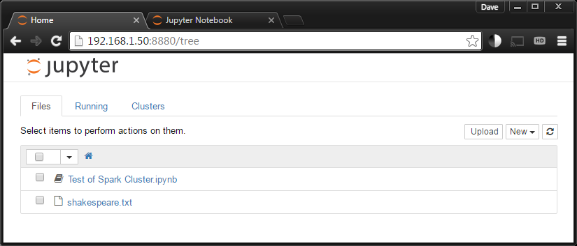
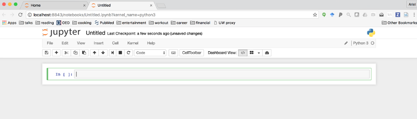

# The Notebook

The *notebook* is a document that allows as to combine text elements (headings, 
paragraphs, hyperlinks), equations (LaTeX), figures and interactive code. The
notebook uses cells to divide text and code: text is formatted using markdown,
and code is executed using the IPython kernel. 

[Markdown](https://daringfireball.net/projects/markdown/) is a simple way to
format text; it has a plain text formatting syntax that can be converted easily
to HTML. It is easy to learn, check out the syntax in the "Daring Fireball" 
(by John Gruber) [webpage](https://daringfireball.net/projects/markdown/syntax).

## How we start the Jupyter notebook app?

If you follow the installation steps for this workshop listed in the [required
software](https://github.com/barbagroup/essential_skills_RRC/blob/master/software_requirements.md)
markdown, you should have jupyter installed. If not, go to the link and follow
the installation requirements.

All set? Let's open a terminal and type `jupyter notebook` hit enter and tadah!!
your default browser will open with the jupyter app. It should look like this:

To start a new notebook click on the top right where it says **New** and click 
in `Python 3`, a new tab will appear in your browser and you will see:

The notebook opens by default with a with a single empty code cell. Try to write
some Python there and execute the cell  by doing `[shift] + [enter]`.

For example:

* `2 * 12` 

* `print('Hello world')`

* `x = 5` #(notice there will be no output)

* `print(x * 'Hi there')`

## What if we want to add a new cell? 

To add a new cell (by default will be a code cell) press the **`+`** that is in
tool bar. 

## What if we want that cell to be a markdown cell? 

In the tool bar you can see a display bar that says **Code**, display that and 
pick **Markdown**. Now you can write some text using the markdown syntax and you
can write some equations using the [LaTeX](https://en.wikipedia.org/wiki/LaTeX).

For example, type in a markdown cell:

`$\frac{d}{dx}\left( \int_{0}^{x} f(u)\,du\right)=f(x)$`

or 

`${\frac {d}{dx}}\arctan(\sin({x}^{2}))=-2\,{\frac {\cos({x}^{2})x}{-2+
\left (\cos({x}^{2})\right )^{2}}}$`

Cool! ah? 

## How we save our work? 

* First lets pick a name for our notebook. Click where it says Untitled (right 
next to the Jupyter logo) and pick the name that you want. 

* You save your changes by either clicking in the floppy disk symbol in the tool
bar or by doing  `[Ctrl] + [s]`. This will save in the directory you are located,
a `.ipynb` file with the name that you pick for your file. 

## The two different modes: Edit mode and Command mode [1]

**Edit mode:**

* We know we are in this mode when we see a green cell boarder and a prompt 
showing in the editor area.

* We enter in **edit mode** by pressing `Enter` or clicking on the cell.

* When we are in edit mode, we can type into the cell, like a normal text editor.

**Command mode:**

* We know we are in this mode when we see a grey cell boarder with a left blue
margin.

* We enter in **command mode** by pressing `Esc` or clicking outside the cell's
area.

* In **command mode** the keyboard is mapped to certain that allows
you to do certain actions easily.

You can find a list of [shortcuts](https://www.cheatography.com/weidadeyue/cheat-sheets/jupyter-notebook/)
in the two different modes, check them out and have fun!

## How we shut down the Kernel?

Once you close your notebook, you will see in the main Jupyter page that your 
notebook file has a green book symbol. You should click in the box at the left 
of that symbol, and then click where it says `shutdown`. Finally, go to the
terminal that we use at the beginning to open the jupyter notebook and type
`[Ctrl] + [c]` and you are all done!

## References:

[1] [Notebook Basics: Modal Editor](http://jupyter-notebook.readthedocs.io/en/latest/examples/Notebook/Notebook%20Basics.html)

